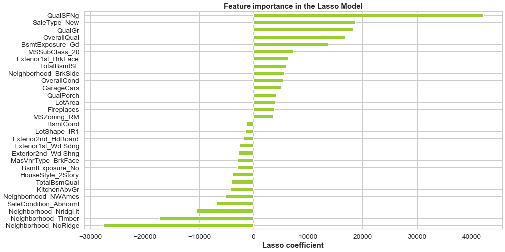

## Introduction:
Using linear regression to predict house prices as a way to discover investment opportunities in Real Estate
## Objective:
A Price predicting model
In order to buy houses, people rely on realtors or listing websites, with data science, we can use the characteristics of the house to predict the potential value of the house.
## The Dataset:
* Kaggle: To obtain the dataset to code along, and for more information on this dataset, visit its description here https://www.kaggle.com/c/house-prices-advanced-regression-techniques/overview

## Skills Required to Complete:
The skills used to complete this project consisted of:
* Working with Python to make visualizations using Matplotlib & Seaborn
* Using Pandas to collect and clean the dataset
* Building & interpreting various classification models based on feature engineering/selection & hyperparameter tuning
* Using Scikit-Learn to compute various metrics relating to classification models
## What Was Posted on GitHub:
A notebook wasposted on GitHub. housing_prices notebook consists of the Data Cleaning, Collection & Modeling components of the project.
## Questions That Were Posed:
* Can you predict the sale price of houses?
* Which features matter the most in dertermining the price of a house?

## How the Data Was Put Together:
The data set describes homes With 79 explanatory variables describing (almost) every aspect of residential homes in Ames, Iowa, sold between 2006-2010.The Ames Housing dataset was compiled by Dean De Cock for use in data science education. It's an incredible alternative for data scientists looking for a modernized and expanded version of the often cited Boston Housing dataset. 

## My approach:
### Comprehensive Data Exploration with Python
* Understand how variables are distributed and how they interact
* Apply different transformations before training machine learning models
* Covers both univariate and multivariate approaches
* Includes visualizations using matplotlib and seaborn
### House Prices EDA
* Learn to use visualization techniques to study missing data and distributions
* Covers both continuous and categorical data
* Includes correlation heatmaps, pairplots, and t-SNE to help inform appropriate inputs to a linear model
### A Study on Regression Applied to the Ames Dataset
* Demonstrate effective tactics for feature engineering
* Includes simplifying and combining existing features
* Explore linear regression with different regularization methods including ridge, LASSO, and ElasticNet using scikit-learn
### Regularized Linear Models
* Build a basic linear model

## Testing
Rsquared and RMSE/RMSLE
## Conclusion
With the XGBR model, an investor can  predict property values at a +/- 12% error margin. As long as the property is  bought below this margin, an investor stands to make a profit and can determine whether or not it’ll be a good investment

## Presentation Link:
https://docs.google.com/presentation/d/1YtVQsDKsDYCYUt-6otzIQGJ_lTj4l3Fyll-rSznS3vw/edit?usp=sharing

## Visual:
The ranking of features according to its importance  in the lasso model

